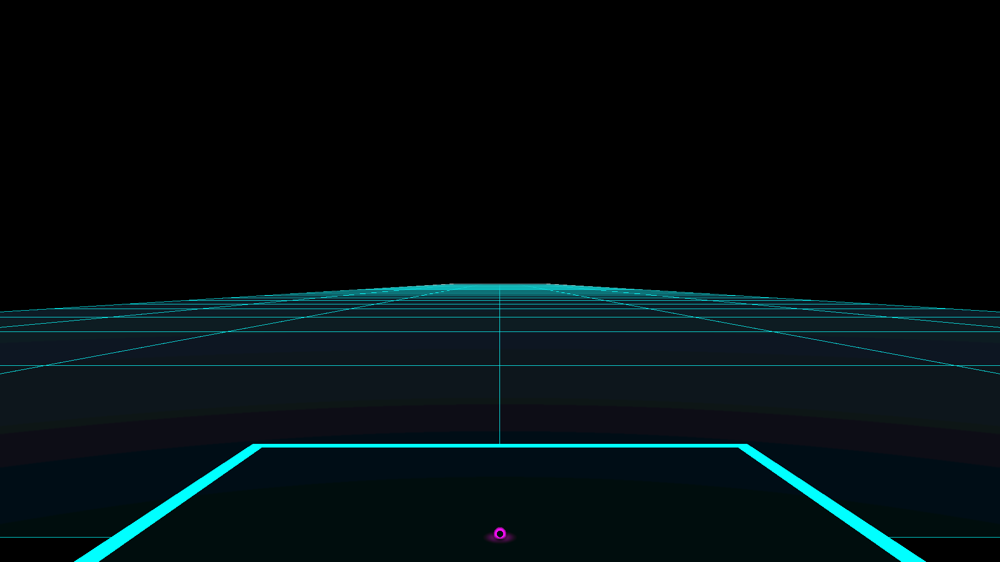

# cyberflight

A (very) digital driving range for golf simulators.

## Launch Monitor Integration

cyberflight receives live shot data from [flighthook](https://github.com/divotmaker/flighthook), an open-source golf automation bus. flighthook connects to your launch monitor and broadcasts shot data over a local WebSocket — cyberflight subscribes as a client to render ball flights in real time.

### Supported launch monitors (via flighthook)

- **FlightScope Mevo+** — WiFi, via [ironsight](https://github.com/divotmaker/ironsight)
- **FlightScope Gen2** — WiFi, via ironsight

### Setup

1. Start flighthook and connect to your launch monitor
2. Start cyberflight — it connects to flighthook automatically on `localhost`
3. Send it
